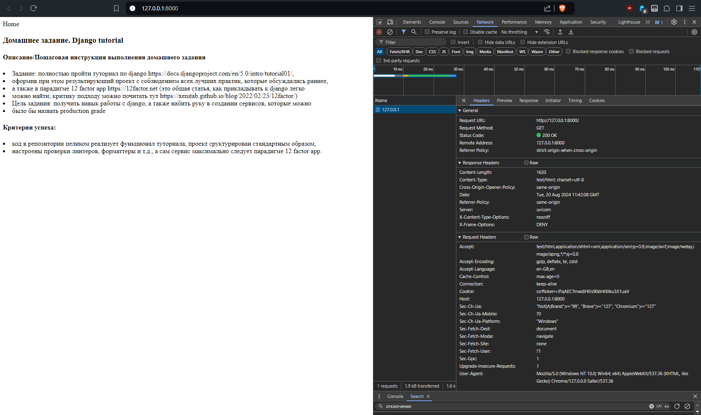

## Задание
### Django tutorial

*Задание*: полностью пройти туториал по django https://docs.djangoproject.com/en/5.0/intro/tutorial01/, оформив при этом результирующий проект с соблюдением всех лучших практик, которые обсуждались раннее, а также в парадигме 12 factor app https://12factor.net (это общая статья, как прикладывать к django легко можно найти; критику подходу можно почитать тут https://xenitab.github.io/blog/2022/02/23/12factor/)

1. Codebase - настроен Git
2. Dependencies - использован pipenv, Docker
3. Config - Django secrets перемещены в environments, сделано разделение на Development/Production
4. Backing services - Django default DB переключена на Postgres DB in Docker, credentials заданы с помощью environments
5. Build, release, run - реализовано с помощью Docker build subsystem / environments
6. Processes - Django static asset реализован посредством WhiteNoise / manage.py collectstatic
7. Port binding - Uvicorn/Gunicorn port bound:

8. Concurrency  - Gunicorn workers/signals
9. Disposability - Gunicorn workers/signals
10. Dev/prod parity - посредством разделения на контейнеры BD и app
11. Logs - задействован Django logging
12. Admin processes - Django admin tools [manage.py]

***
