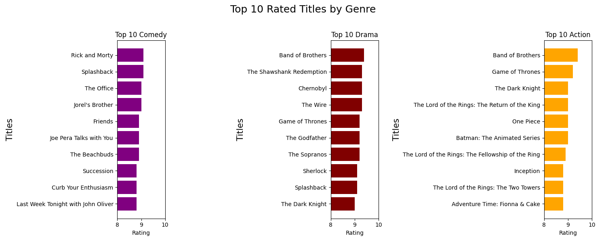

### Исследовательский анализ данных

Выбрать из каталога любой интересующий dataset и провести его анализ в вольном стиле

Датасет: * https://www.kaggle.com/datasets/octopusteam/full-hbo-max-dataset?resource=download

Датасет представляет собой коллекцию рейтингов фильмов и шоу, доступных на HBO Max.  
(Daily-updated of the HBO Max Movies & TV Series Dataset)  

Результат работы:  

Top 10 фильмов и шоу:
  

10 худших фильмов и шоу:
  

Top 10 фильмов и шоу в жанрах 'Comedy', 'Drama', 'Action':
  

Коллаж "облако тэгов":
  

***
