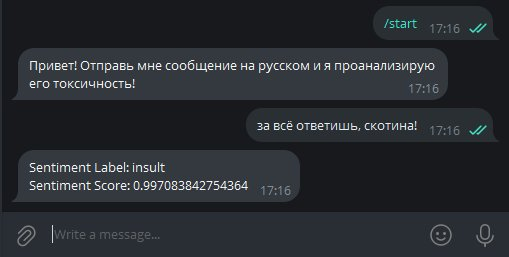

### OTUS-GPT
***
Цель:

Настроить предобученную GPT-like модель

Описание/Пошаговая инструкция выполнения домашнего задания:

В данном домашнем задании предлагается выбрать на свое усмотрение одну из открытых генеративных моделей на HuggingFace, донастроить его под интересующий кейс и реализовать своего бота\агента или даже сеть\цепь агентов

***

Подключена модель cointegrated/rubert-tiny-toxicity с https://huggingface.co/cointegrated/rubert-tiny-toxicity
Определяет степень "токсичности" текста.

использовано API ML-модели из ДЗ №09, код находится в папке app
Вход: строка текста

Выход: JSON вида 
{
  "text": "Кто тут котиков не любит?",
  "sentiment_label": "non-toxic",
  "sentiment_score": 0.9998007416725159
}

{
  "text": "За всё ответишь, скотина!",
  "sentiment_label": "insult",
  "sentiment_score": 0.997105062007904
}

Запуск локально: uvicorn app.app:app --host 127.0.0.1 --port 8080

Проверка API локально: http://127.0.0.1:8080/docs

В качестве интерфейса пользователя написан простой telegram-bot, код находится в папке tg_bot.

В целях теста и отладки бот и API запускаются локально, скриншот результата работы приведен ниже:

***
