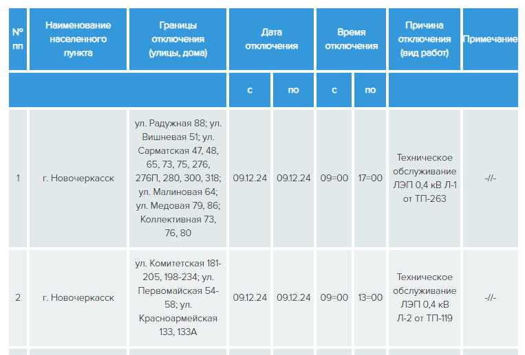
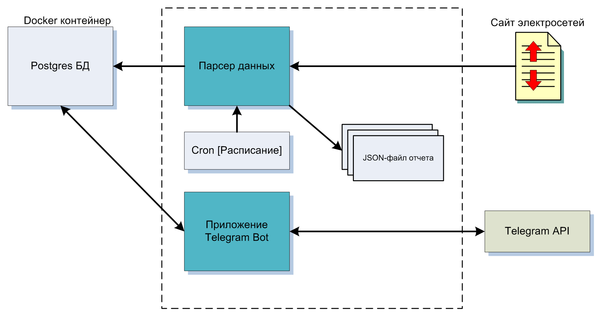
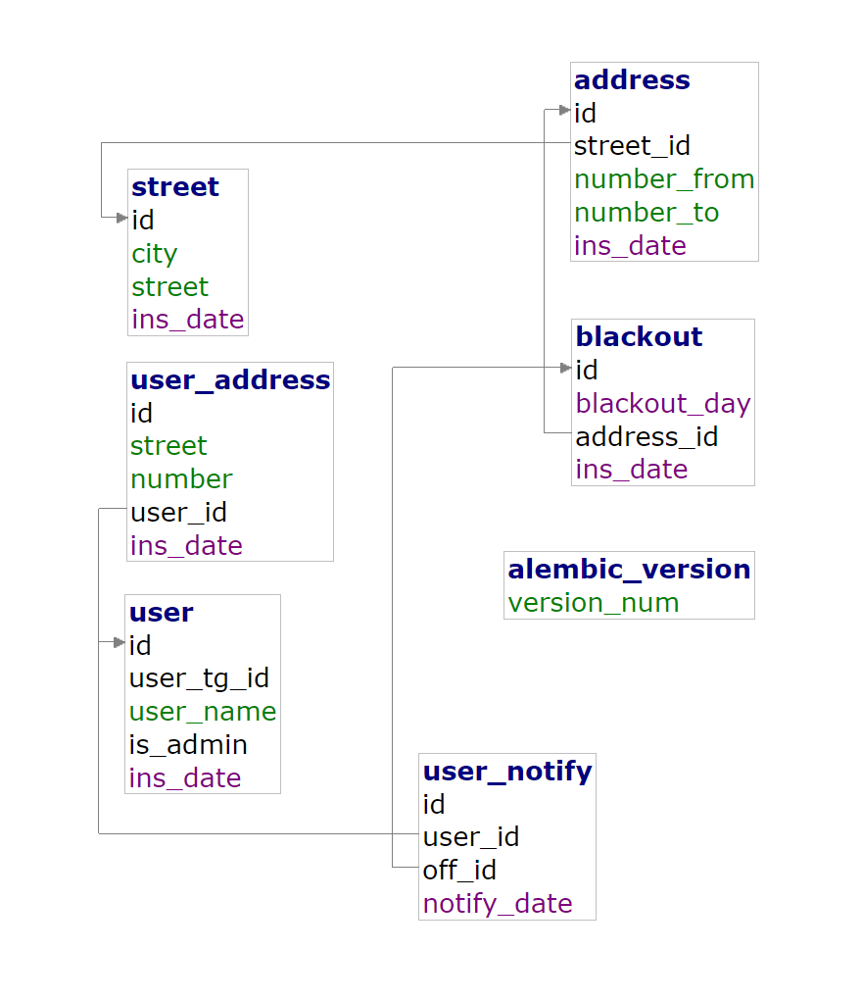
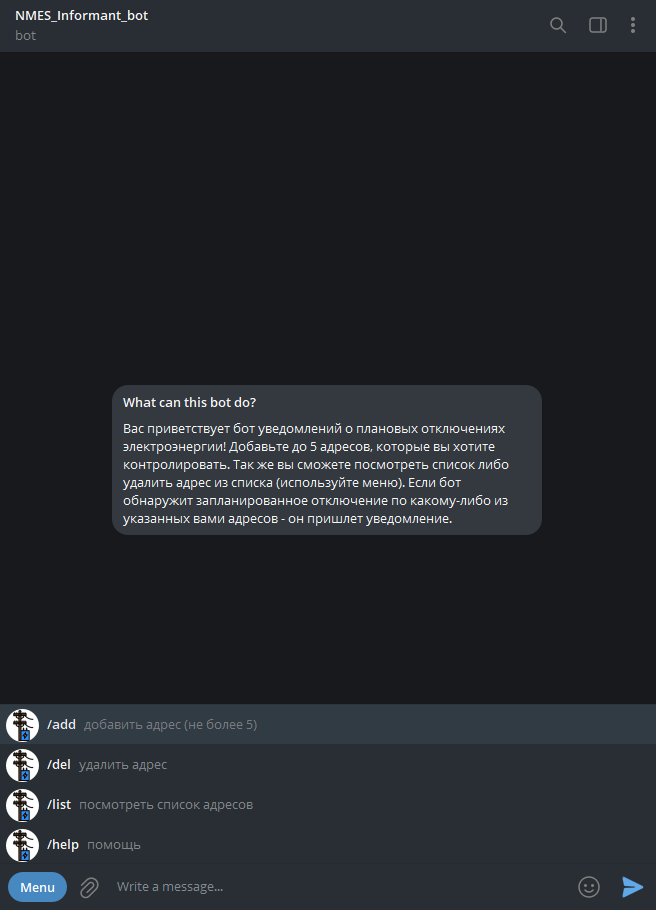
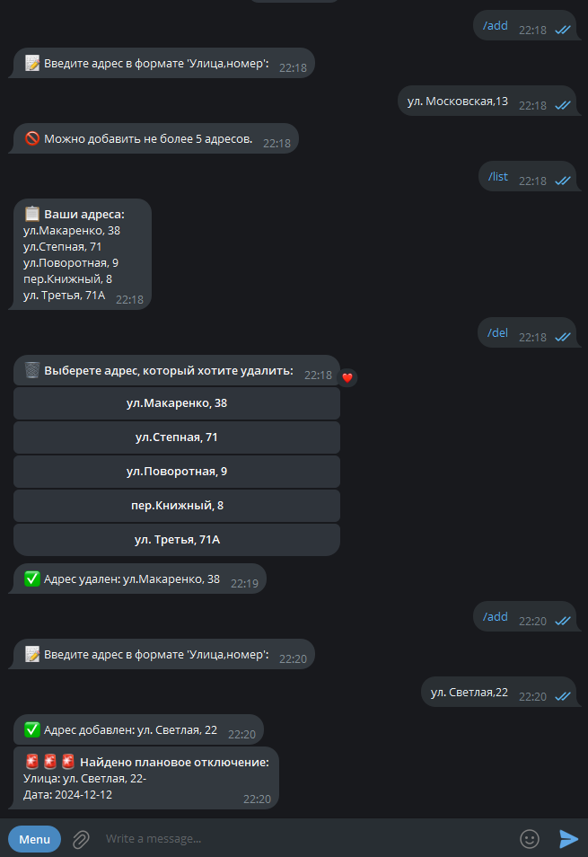

### Проект  

#### "Telegram-бот для автоматизированного оповещения о плановых отключениях электроэнергии"
***
Местные электросети регулярно публикуют список плановых отключений электроэнергии, но никакой автоматизации по 
оповещению не предполагают - нужно самому постоянно заходить на страницу https://www.donenergo.ru/grafik-otklyucheniy/57/1/ и
искать свой адрес (адреса) самостоятельно. Список может обновляться втечении рабочего дня (с 8-00 по 17-00 Мск). 

Пример списка отключений приведен ниже:  

  

#### Цель: разработать Telegram-bot, который будет оповещать о грядущих плановых отключениях по адресам, задаваемым пользователем. Максимальное количество адресов - 5. Пользователь должен иметь возможность просматривать, добавлять или удалять свои адреса.  

Был определен следующий алгоритм работы:
- Три раза в день производится парсинг данных со страницы и помещается в базу данных, паралельно "для истории" исходные данные парсинга сохраняются в JSON-файлах.
- Пользователь посредством бота задает до пяти адресов, по которым он хочет иметь информацию об отключениях, адреса заносятся в базу данных.
- По событиям "добавлен адрес" или "выполнен очередной парсинг" производится сопоставление адресов отключений и адресов пользователей
- Ботом выполняется рассылка оповещений пользователям, по которым найдено совпадение адресов. Время оповещения фиксируется в базе данных.
  
Примененные технологии/стеки/фреймверки:
- Парсинг HTML - BeautifulSoup
- Исходные данные парсинга - JSON-файлы
- Разбор записей - RegExps
- СУБД - Postgres
- Контейнеризация - Docker
- ORM - SQLAlchemy
- Управление миграциями БД - Alembic
- Telegram-bot - AIOgram
- Memcache / Queue - Redis
  
Рисунок ниже иллюстрирует схему взаимодействия:  

  

Краткое описание функционала:  
1. Парсер  
Посредством запуска по расписанию либо вручную производит загрузку данных с определенной HTML-страницы, их фильтрацию и разбор на составляющие элементы.
Полученные данные сохраняются в JSON-файл отчета на диск и в таблицы базы данных. Парсер проверяет, есть ли в базе данных данные предыдущего парсинга и если таковые имеются - очищает таблицы, затем заносит новые данные. По окончании работы парсер отправляет в очередь Redis'а сообщение, что данные подготовлены и завершает работу. 
2. База данных (БД)  
Предназначена для хранения данных об отключениях, пользователях и пользовательских адресах. Размещается в отдельном Docker-контейнере. В процессе работы взаимодействие с БД очуществляют приложение Telegram-бота и парсер. В будущем планируется создать личный кабинет администратора (администраторов) бота на Django.
Схема таблиц БД приведена на рисунке ниже.  

  
3. Telergram-бот  
Выполняет взаимодействие с пользователем посредством команд меню. Доступны команды для добавления/просмотра/удаления адреса. По добавлению адреса производится проверка на наличие отключений по этому адресу. Так же проверка выполняется по всем пользователям/адресам после очередного парсинга данных с сайта электросетей - для этого отслеживается определенное сообщение в очереди Redis'а. На скриншотах ниже приведены примеры работы бота.  

  

  

***
#### Примечание:  

в учебных целях бот работает НЕ в режиме 24/7 (как должен), а запускается по надобности. В будущем будет размещен на сервере для работы в режиме 24/7.
